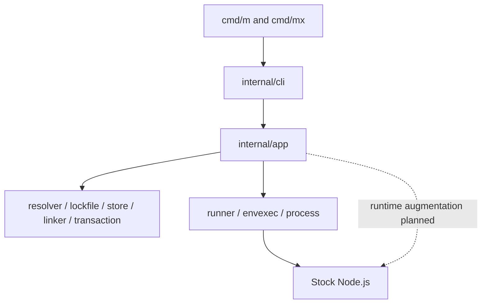

# MewJS

Go-powered JavaScript package manager and toolchain built around stock Node.js.

[](https://github.com/mewisme/mew/actions/workflows/ci.yml)
[](https://go.dev/)
[](LICENSE)

**MewJS** (abbreviated **Mew**) is a Go control plane for JavaScript projects: transactional dependency management, lockfile adapters, script and executable execution, and supply-chain tooling. It runs **stock Node.js** — Mew does not fork, patch, embed, or replace Node.

The primary binary is **`m`** (alias **`mew`**). The package executable runner is **`mx`** (alias **`mewx`**). Installer-shipped aliases are not distributed automatically with release binaries; use the [development installer](CONTRIBUTING.md#development-installation) for local `mew` / `mewx` shims. New Mew-owned projects use the native lockfile **`m.lock`**.

> **Status:** Active development. Build from source — there are no published GitHub releases or official installers yet. A [development installer](CONTRIBUTING.md#development-installation) (`scripts/install-dev.*`) is available for local use only.
>
> **Implemented:** package-manager core (MVP **0031**); runner surfaces (`m run`, `m exec`, `mx`, workspace orchestration when enabled, snapshot/capsule offline execution) with conformance certification in [`docs/runner-compatibility.md`](docs/runner-compatibility.md).
>
> **Experimental (gated):** direct `m <script>` shortcuts, verified-bin direct dispatch, isolated linker, global store, lifecycle scripts, workspace install filters.
>
> **Planned:** runtime augmentation (**0050+**), Node and external PM management (**0060+**), `init` / `link`, public distribution (**0072+**).
>
> Authoritative status: [`docs/core-certification.md`](docs/core-certification.md), [`docs/runner-compatibility.md`](docs/runner-compatibility.md), [`features/inventory.json`](features/inventory.json), [`plans/CHECKLIST.md`](plans/CHECKLIST.md) (checklist may lag code).

## Why Mew

Mew targets teams that want a single Go-native toolchain for package management, explainable dependency graphs, recoverable installs, and script execution — without maintaining a custom JavaScript runtime.

| Differentiator | What it means |
|---|---|
| Go control plane | Concurrency, storage, diagnostics, and process supervision in Go |
| Stock Node boundary | Execution uses the user's Node binary; augmentation surfaces are planned, not a Node fork |
| Transactional mutation | Install-family changes stage, validate, and commit atomically with rollback |
| Content-addressed store | Verified blobs, smart linking, optional global store (gated) |
| Explainable resolution | `m resolve`, `m explain`, `m plan`, semantic lock diffs |
| Lockfile adapters | Incumbent formats normalize into a shared graph; mutation limits are explicit |
| Verified executables | `node_modules/.mew/bins.v1.json` binds installed bins to a generation |
| Conformance and diagnostics | Typed `ERR_M_*` errors, `m doctor`, `m conformance`, certification harnesses |

## What is available

Capabilities below are implemented and covered by tests or certification fixtures. Run `m features` for the machine-readable matrix.

| Domain | Status | Highlights |
|---|---|---|
| Dependency management | Implemented | `install`, `add`, `remove`, `update`, `ci`, `dedupe`, `prune`, `ls`, `outdated` |
| Workspaces | Implemented (gated) | Discovery, catalogs, `--filter` on install family; workspace `m run` with `-r` / `--filter` |
| Lockfiles | Implemented | Native `m.lock`; pnpm 9/10/11 semantic mutation; npm/Yarn/Bun read and byte-preserving paths |
| Store and cache | Implemented | Global content store, registry metadata cache, verified integrity |
| Transaction and recovery | Implemented | Journal v3, project lock, `recover`, `rollback`, crash integration tests |
| Snapshots and capsules | Implemented | `snapshot list/restore`, `history`, `capsule create/restore` |
| Script execution | Implemented | `m run` — hooks, `--` forwarding, signals, workspace orchestration |
| Executable execution | Implemented | `m exec` (local, snapshot, capsule); `mx` DLX with consent and cache |
| Direct shortcuts | Experimental | `m <script>` and verified `m <bin>` behind config/env gates |
| Security and supply chain | Implemented | `audit` (advisory scanning), `sbom`, `policy`, `verify provenance`, lifecycle trust |
| Diagnostics | Implemented | `doctor`, `features`, `conformance`, `bench install` |

**Reserved stubs** (`ERR_M_UNIMPLEMENTED`): `init`, `link` only.

**Not available:** TypeScript/runtime augmentation, Node version management, global installs, official binary distribution.

## Quick start

**Prerequisites:** Go **1.26.5+** ([`go.mod`](go.mod)). Set `CGO_ENABLED=0` for production builds.

#### PowerShell

```powershell
git clone https://github.com/mewisme/mew.git
cd mew
$env:CGO_ENABLED = "0"
go build -o bin/m.exe ./cmd/m
go build -o bin/mx.exe ./cmd/mx
```

#### POSIX shell

```sh
git clone https://github.com/mewisme/mew.git
cd mew
CGO_ENABLED=0 go build -o bin/m ./cmd/m
CGO_ENABLED=0 go build -o bin/mx ./cmd/mx
```

Run without installing: `go run ./cmd/m version` and `go run ./cmd/mx version`.

Optional local install (not a release channel): `pwsh -NoProfile -File scripts/install-dev.ps1` or `./scripts/install-dev.sh` — see [`CONTRIBUTING.md`](CONTRIBUTING.md#development-installation).

In a project with `package.json`:

```sh
m version
m features
m doctor
m install
m run build
m exec <binary> [-- args]
mx <package-spec> --yes -- <args>   # non-interactive consent for CI
```

Human terminal output defaults to rich styling only on eligible interactive
terminals (`--output=auto`). Use `--output=plain`, `--accessible`, or
`MEW_PRESENTATION=legacy` when you need append-only / pre-Charm paths. See
[`docs/architecture/cli-presentation.md`](docs/architecture/cli-presentation.md)
and [`docs/accessibility.md`](docs/accessibility.md).

## Command overview

| Area | Commands | Purpose |
|---|---|---|
| Discovery | `project`, `pkg`, `doctor`, `features` | Project layout, health, capability matrix |
| Install family | `install`, `add`, `remove`, `update`, `ci`, `dedupe`, `prune` | Dependency mutations (transaction-backed) |
| Inventory | `ls`, `outdated`, `view`, `resolve` | Installed graph, registry metadata, dry resolve |
| Lockfile | `lock validate`, `lock format`, `lock migrate`, `diff lock` | Native and incumbent lock handling |
| Planning | `plan`, `plan update`, `explain` | Mutation previews and resolver traces |
| Recovery | `recover`, `rollback`, `snapshot`, `history` | Interrupted txn recovery and restore |
| Scripts | `run` | Package scripts with hooks and workspace orchestration |
| Executables | `exec`, `mx`, `env inspect` | Local bins, snapshot/capsule exec, DLX, environment inspection |
| Store / cache | `store`, `cache` | Content store and registry metadata cache |
| Supply chain | `audit`, `sbom`, `policy`, `verify`, `trust` | Advisories, SBOM export, policy, provenance, lifecycle trust |
| Advanced | `fetch`, `pack`, `publish`, `patch`, `capsule` | Non-registry sources, packing, publication, capsules |
| Diagnostics | `conformance`, `bench` | Certification harnesses and install benchmarks |

Full reference: [`docs/pm-commands.md`](docs/pm-commands.md), [`docs/cli.md`](docs/cli.md), [`docs/runner.md`](docs/runner.md).

## Execution model

Mew launches **stock Node.js** (or package binaries) through a shared environment builder (`internal/runner/envexec`).

| Surface | Role |
|---|---|
| `m run <script>` | Resolve package scripts, expand lifecycle hooks, forward args after `--`, propagate signals |
| `m exec <bin>` | Resolve local `.bin` entries with verified metadata; `--snapshot` / `--capsule` for frozen environments |
| `mx <spec>` | Local-first temporary package execution (DLX); `mx -p <spec> <cmd>` for explicit commands; `mx cache prune` |
| `m env inspect` | JSON inspection of project, DLX, snapshot, or capsule execution environments |

**Workspace scripts:** `m -r run <script>` or `m --filter <pattern> run <script>` when workspaces are enabled (`MEW_EXPERIMENTAL_WORKSPACES=1` or `workspaces.enabled`).

**Experimental dispatch** (same runner, gated):

- `m <script>` — `MEW_EXPERIMENTAL_DIRECT_SCRIPTS=1` or `runner.direct_scripts.enabled`
- `m <verified-bin>` — `MEW_EXPERIMENTAL_EXEC_DIRECT_DISPATCH=1` or `runner.exec.direct_dispatch.enabled`

Built-in commands always win over script shortcuts. `mx` requires consent in interactive terminals; pass `--yes` in CI.

Details: [`docs/runner.md`](docs/runner.md), [`docs/runner-compatibility.md`](docs/runner-compatibility.md).

## Safety and reproducibility

Install-family mutations follow:

```text
inspect → resolve → plan → fetch → verify → stage → validate → commit
```

| Mechanism | Purpose |
|---|---|
| Project lock (`.mew/txn/lock`) | Cross-process exclusive guard with stale recovery |
| Journal v3 (`.mew/txn/<id>/`) | Staged artifacts and commit steps |
| `m recover` | Roll back incomplete authoritative journals |
| `m rollback` / `m snapshot restore` | Restore prior project state through the mutation boundary |
| Verified store | Digest-checked put/get; corrupt blob quarantine |
| Lifecycle trust | `.mew/trusted-packages.json` gates script execution |
| Snapshot / capsule integrity | Offline execution boundaries for frozen graphs |

`m exec --snapshot`, `m exec --capsule`, and `mx` DLX do not mutate the project lockfile or `package.json`.

Lifecycle sandboxing and capability restrictions are **best-effort** — not full process containment. Crash guarantees cover defined injection suites; they do not imply immunity from OS-level corruption or manual tampering.

See [`docs/transaction.md`](docs/transaction.md), [`docs/security-pm-core.md`](docs/security-pm-core.md).

## Compatibility

**Platforms:** Linux, macOS, and Windows. Binaries cross-compile to **amd64** and **arm64** with `CGO_ENABLED=0`. CI executes tests on `ubuntu-latest`, `macos-latest`, and `windows-latest` (GitHub-hosted amd64 runners). **Stock Node.js** is required for script and executable execution.

**Linker layouts:** hoisted (default). Isolated (`pnpm`-style) layout requires `MEW_EXPERIMENTAL_ISOLATED_LINKER=1` or explicit config.

**Lockfile adapters** — detection, read, write, and mutation are separate capabilities:

| Format | Detect | Read | Write | Semantic mutation | Notes |
|---|---|---|---|---|---|
| `m.lock` | Yes | Yes | Yes | Yes | Native format (`lockfileVersion: 3`) |
| `pnpm-lock.yaml` | Yes | Yes | Yes | Yes | pnpm **9, 10, 11** only (`lockfileVersion: '9.0'`) |
| `nub.lock` | Yes | Yes | Yes | Yes | Derived-format fixture validation |
| `package-lock.json` | Yes | Yes | Byte-preserving no-op | No | v2/v3 parse and frozen install |
| `npm-shrinkwrap.json` | Yes | Yes | Byte-preserving no-op | No | Same read-only incumbent policy |
| `yarn.lock` (Classic) | Yes | Yes | Byte-preserving no-op | No | Graph-changing mutation not supported |
| `yarn.lock` (Berry, `node_modules`) | Yes | Yes | Byte-preserving no-op | No | Graph-changing mutation not supported |
| `yarn.lock` (Berry, PnP) | Yes | Yes | No | No | Parse and identity only; PnP install rejected |
| `bun.lock` | Yes | Yes | Byte-preserving no-op | No | Graph-changing mutation not supported |

Mew does **not** claim universal CLI or install parity with npm, pnpm, Yarn, or Bun. Each adapter documents its certified scope. Migration is explicit (`m lock migrate`) — foreign lockfiles are not silently rewritten.

Details: [`docs/compatibility-axes.md`](docs/compatibility-axes.md), [`docs/lockfile.md`](docs/lockfile.md), [`docs/migration.md`](docs/migration.md).

## Project files

```text
project/
├─ package.json          # committed — manifest and scripts
├─ m.lock                # committed for Mew-native projects
├─ m.jsonc               # optional project config
├─ .mew/                 # local — project control state
│  ├─ txn/               # transaction journals and project lock
│  ├─ snapshots/         # restorable install snapshots
│  ├─ trusted-packages.json
│  ├─ generation.json
│  └─ store-manifest.json
└─ node_modules/         # local — installed dependency tree
   └─ .mew/
      └─ bins.v1.json   # verified executable metadata
```

Root **`.mew`** holds persistent control state that must survive `node_modules` replacement: transactions, snapshots, lifecycle trust, and generation binding. **`node_modules/.mew`** holds metadata tied to the current install tree.

Global cache and content store paths are configurable — see [`docs/config.md`](docs/config.md) and [`docs/store.md`](docs/store.md). Do not commit `.mew` or `node_modules`.

## Architecture



- `cmd/m` and `cmd/mx` are thin entrypoints into `internal/cli`.
- `internal/app` orchestrates resolve-then-mutate workflows and execution.
- Domain packages (`resolver`, `lockfile`, `store`, `linker`, `transaction`) expose narrow interfaces; work is cancellable via `context.Context`.
- Resolution completes before filesystem mutation; commits happen only after validation.
- The runner stack launches stock Node and package binaries; runtime augmentation (TypeScript, loaders, watch) is planned (**0050+**).
- Public failures use stable `ERR_M_*` codes at the CLI boundary.

Package map: [`docs/architecture/README.md`](docs/architecture/README.md).

## Documentation

### User guides

| Topic | Document |
|---|---|
| CLI reference | [`docs/cli.md`](docs/cli.md) |
| PM commands | [`docs/pm-commands.md`](docs/pm-commands.md) |
| Install | [`docs/install.md`](docs/install.md) |
| Lockfiles | [`docs/lockfile.md`](docs/lockfile.md) |
| Configuration | [`docs/config.md`](docs/config.md) |
| Error codes | [`docs/errors.md`](docs/errors.md) |
| Doctor | [`docs/doctor.md`](docs/doctor.md) |

### Runner and execution

| Topic | Document |
|---|---|
| Script and exec runner | [`docs/runner.md`](docs/runner.md) |
| Runner certification | [`docs/runner-compatibility.md`](docs/runner-compatibility.md) |
| Runner events | [`docs/runner-events.md`](docs/runner-events.md) |

### Architecture

| Topic | Document |
|---|---|
| Overview | [`docs/architecture/README.md`](docs/architecture/README.md) |
| Package map | [`docs/architecture/package-map.md`](docs/architecture/package-map.md) |
| Transaction boundary | [`docs/architecture/transaction-boundary.md`](docs/architecture/transaction-boundary.md) |
| Transactions (user) | [`docs/transaction.md`](docs/transaction.md) |

### Compatibility

| Topic | Document |
|---|---|
| Compatibility axes | [`docs/compatibility-axes.md`](docs/compatibility-axes.md) |
| npm locks | [`docs/npm-lockfile.md`](docs/npm-lockfile.md) |
| Yarn locks | [`docs/yarn-lockfile.md`](docs/yarn-lockfile.md) |
| Bun locks | [`docs/bun-lockfile.md`](docs/bun-lockfile.md) |
| Migration | [`docs/migration.md`](docs/migration.md) |

### Testing and certification

| Topic | Document |
|---|---|
| Testing strategy | [`docs/testing.md`](docs/testing.md) |
| Core certification | [`docs/core-certification.md`](docs/core-certification.md) |
| Core evidence | [`docs/evidence/core/README.md`](docs/evidence/core/README.md) |
| Runner evidence | [`docs/evidence/runner/0046/README.md`](docs/evidence/runner/0046/README.md) |
| Engineering gates | [`docs/engineering.md`](docs/engineering.md) |

### Roadmap and feature status

| Topic | Document |
|---|---|
| Feature inventory | [`features/inventory.json`](features/inventory.json) |
| Implementation checklist | [`plans/CHECKLIST.md`](plans/CHECKLIST.md) |
| Plan index | [`plans/INDEX.md`](plans/INDEX.md) |
| Charter | [`docs/charter.md`](docs/charter.md) |

## Development and testing

Read [`CONTRIBUTING.md`](CONTRIBUTING.md) before contributing.

**Build and test (PowerShell):**

```powershell
gofmt -w <changed-go-files>
$env:CGO_ENABLED = "0"
go test ./... -count=1
go vet ./...
go build -o bin/m.exe ./cmd/m
go build -o bin/mx.exe ./cmd/mx
```

**Lint, vulnerability, allowlist:**

```powershell
golangci-lint run ./...          # pinned via tools/versions.env
govulncheck ./...
go run ./tools/check-license
go run ./tools/check-deps
```

**Race (separate; may enable CGO for the race instrument):**

```powershell
go test -race ./... -count=1
```

**Conformance and certification:**

```powershell
go test ./tests/conformance/... -count=1
go run ./tools/conformance/verify-fixtures
go run ./tools/ci/verify-crash-shards
go run ./cmd/m conformance run core
go run ./cmd/m conformance run runner
make core-cert-fast
```

Install pinned tools: [`tools/install.ps1`](tools/install.ps1) or [`tools/install.sh`](tools/install.sh).

CI runs in two tiers. The blocking gate on every pull request is
[`.github/workflows/ci.yml`](.github/workflows/ci.yml): formatting, static
analysis, `go test ./... -short` on Linux, a build, and one limited Windows smoke
job. The heavy suites — full three-OS matrix, race detector, cross compilation,
lock conformance, crash integration, soak, benchmarks, certification, and
`govulncheck` — run in [`.github/workflows/full.yml`](.github/workflows/full.yml)
nightly, on demand, and for release tags. See
[`docs/core-certification.md`](docs/core-certification.md).

## Roadmap

Delivery order ([`plans/INDEX.md`](plans/INDEX.md)):

1. Foundation and package-manager core (**0001–0031**) — complete
2. Script and executable runners (**0040–0046**) — implemented and conformance-certified; checklist bookkeeping may lag
3. Runtime augmentation — stock Node launch, TypeScript, loaders, watch (**0050–0057**) — implementation complete, certification pending
4. **Next:** Node and PM management (**0060–0062**)
5. Product tooling and public distribution (**0070–0074**)
6. Cross-cutting conformance, security, and governance programs (**0080+**)

Experimental gates and waivered surfaces may change before the runtime stabilization gate. Track [`plans/CHECKLIST.md`](plans/CHECKLIST.md) for plan-level status.

## Contributing

1. Read [`AGENTS.md`](AGENTS.md) and [`CONTRIBUTING.md`](CONTRIBUTING.md).
2. Preserve package boundaries ([`docs/architecture/forbidden-imports.md`](docs/architecture/forbidden-imports.md)).
3. Add tests and deterministic fixtures for behavior changes.
4. Update [`features/inventory.json`](features/inventory.json) and user docs for public surface changes.
5. Preserve transaction safety on install-family paths.
6. Run focused tests, then applicable gates before pushing.

## License

MewJS is licensed under the Apache License, Version 2.0. See [`LICENSE`](LICENSE) and [`NOTICE`](NOTICE).
